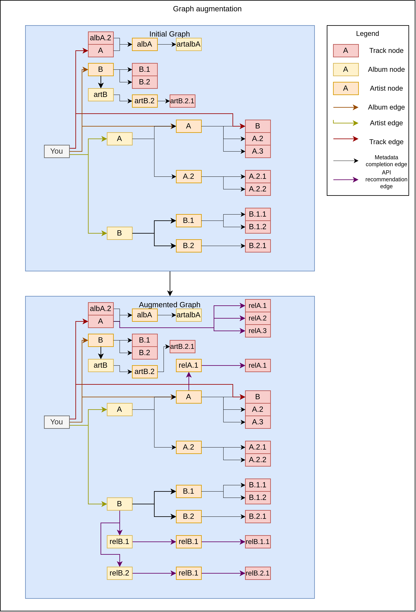

# Graph creation

## Usage

TODO: do the script and serialization of a music graph

To create and store a base graph:
```
python -m music_graph.data.general_fetcher fetch_graph_and_write your_user_id 0 your_path
```

To create and store an augmented graph:
```
python -m music_graph.data.general_fetcher fetch_graph_and_write your_user_id 1 your_path
```

To merge two separate graphs:
```
python -m music_graph.data.general_fetcher merge_graphs_and_write graph_paths...
```

## Primary graph extraction

We convert the library from tidal/spotify etc. to a graph where each like of an album/artist/playlist/album is tracked as an edge in the graph.
First step is to generate the full graph with metadata generated links such as connecting an album to its tracks when an album is present in the graph, same with tracks to albums, albums to artists and vice versa.
This processed is described with the example of the following figure:

<div>
    
</div>

## Graph augmentation

At this point we have the graph of liked datapoints with stronger links for directly liked items.
We can augment the data by adding related artists/tracks/artists/playlists for each of the liked items in the graph.


<div>
    
</div>
